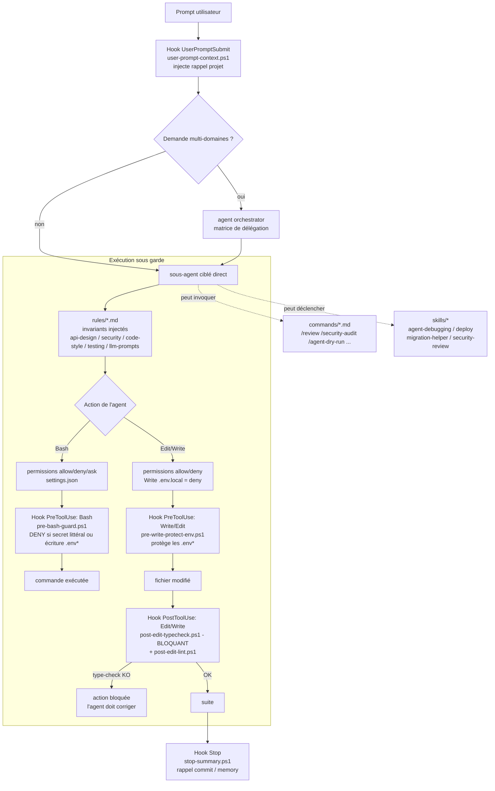

# `.claude/` — Configuration Claude Code de ProspectionAgent

Configuration Claude Code **réelle et versionnée** de ce projet (agent de prospection BEGES : Next.js 15 / Supabase / Gemini / Vercel cron). Tout ce qui est décrit ici existe sur le disque — ce README est tenu à jour comme du code.

La valeur de ce dossier n'est pas dans une pièce isolée, mais dans leur **intégration** : un hook bloque un mauvais commit avant qu'il n'arrive, les permissions cadrent ce que l'agent peut lancer sans demander, les `rules/` injectent les invariants du projet, et un agent `orchestrator` route les demandes multi-domaines vers 11 sous-agents spécialisés. Voir [Comment ces pièces s'orchestrent](#comment-ces-pièces-sorchestrent).

---

## Structure réelle

```
.claude/
├── README.md                 # Ce fichier
├── settings.json             # Permissions (allow/deny/ask) + hooks + env
├── MEMORY.md                 # Index des notes de contexte
├── agents/                   # 11 sous-agents (Task tool) + 1 orchestrateur + 1 plan archivé
├── commands/                 # 12 slash commands (/deploy, /review, ...)
├── context/                  # Fiches détaillées (pipeline, scoring, APIs, ...)
├── hooks/                    # 6 hooks PowerShell (garde-fous automatiques)
├── rules/                    # 5 règles toujours applicables (api-design, code-style, ...)
└── skills/                   # 4 workflows activés par contexte
```

---

## Les agents (réels)

Tous les fichiers ci-dessous existent dans `.claude/agents/`. Chaque agent a un périmètre **chirurgical** (jeu d'outils restreint) — c'est ce qui rend l'orchestration fiable : on délègue à l'agent qui a exactement les droits qu'il faut, ni plus, ni moins.

| Agent | Rôle (1 ligne) | Modèle | Outils | Accès |
|-------|----------------|--------|--------|-------|
| **orchestrator** | Découpe une demande multi-domaines et la route vers les bons sous-agents | opus | Read, Write, Edit, Bash, Glob, Grep | écriture |
| **agent-pipeline-engineer** | Pipeline nocturne `lib/agent/` : sourcing, ADEME, scoring, enrichissement, scoring Gemini | opus | Read, Write, Edit, Bash, Glob, Grep | écriture |
| **supabase-schema-keeper** | Migrations SQL, RLS, colonnes, index, régénération des types TS | sonnet | Read, Write, Edit, Bash, Glob, Grep | écriture |
| **nextjs-route-architect** | Routes `app/`, Server/Client Components, route handlers, `middleware.ts` | sonnet | Read, Write, Edit, Bash, Glob, Grep | écriture |
| **external-api-integrator** | Connecteurs Sirene / ADEME / Recherche Entreprises / Pappers / Hunter / Resend / Gemini | sonnet | Read, Write, Edit, Bash, Glob, Grep | écriture |
| **prompt-engineer** | Prompt Gemini de `lib/agent/gemini-scoring.ts` (scoring d'intérêt + raisons commerciales) | opus | Read, Write, Edit, Bash, Glob, Grep | écriture |
| **ui-component-builder** | Composants `components/`, Tailwind v4 brut, dark mode, a11y | sonnet | Read, Write, Edit, Bash, Glob, Grep | écriture |
| **cron-watchdog** | `vercel.json`, `/api/agent/run`, `/api/notifications/daily`, idempotence, `CRON_SECRET`, Sentry | sonnet | Read, Write, Edit, Bash, Glob, Grep | écriture |
| **test-engineer** | Tests Vitest : mocks Sirene/ADEME/Gemini/Resend, tests de phase d'orchestrateur, tests RLS | sonnet | Read, Write, Edit, Bash, Glob, Grep | écriture |
| **beges-domain-expert** | Réglementation BEGES (seuils L. 229-25, validité 4 ans, NAF prioritaires, pondérations scoring) | opus | Read, Grep, Glob | **read-only** |
| **security-auditor** | Audit RLS, `CRON_SECRET` timing-safe, isolation service_role, secrets, SSRF, Zod | opus | Read, Grep, Glob | **read-only** |
| **code-reviewer** | Review d'un diff/PR contre la checklist projet (TS strict, RLS, prompts versionnés, fallbacks) | sonnet | Read, Bash, Glob, Grep | **read-only** (review) |

> **À noter** : `beges-domain-expert`, `security-auditor` et `code-reviewer` sont volontairement **sans `Write`/`Edit`** : ils conseillent, auditent, reviewent — ils ne modifient jamais le code. C'est une garantie structurelle, pas une convention.

`agents/PARALLEL_FIX_SOURCING.md` n'est **pas** un agent invocable : c'est un **plan d'exécution parallèle archivé** (partition de fichiers disjoints entre 4 agents + 1 agent de tests) conservé comme trace d'un fix mené en fan-out. Il illustre comment l'orchestration parallèle a été menée concrètement sur ce repo.

### Modèle LLM du produit (pour lever toute ambiguïté)

Le moteur LLM du pipeline est **Google Gemini `gemini-2.0-flash`**, dans `lib/agent/gemini-scoring.ts`. Il produit, par prospect, un **score d'intérêt commercial 0-100** + **3 à 5 raisons commerciales** (ordre ROI → image → légal), en JSON structuré validé par Zod, avec fallback propre sur échec. Il n'y a pas de génération de pitch GPT-4o dans le pipeline actuel (`pitch-gen.ts` n'existe plus). Les agents/commands ci-dessus reflètent cette réalité.

---

## Les commands (slash)

12 slash commands dans `.claude/commands/`, déclenchées explicitement par l'utilisateur (`/nom`) :

| Commande | Effet |
|----------|-------|
| `/deploy` | Checklist déploiement Vercel (type-check, lint, test, build, env, migrations, crons, Sentry, smoke tests) |
| `/review` | Code review d'un diff/PR selon les standards du projet |
| `/fix-issue` | Workflow correction de bug : test rouge → fix minimal → non-régression pipeline |
| `/security-audit` | Audit sécurité complet (cron, RLS, service_role, SSRF, secrets, Zod, headers) |
| `/agent-dry-run` | Exécute le pipeline en local **sans écrire en base** |
| `/test-agent-run` | Exécute le pipeline complet **en écrivant en base** (test E2E) |
| `/update-pitch-prompt` | Procédure de modification du prompt Gemini (dry-run 3 prospects + versioning) |
| `/check-rls` | Vérifie l'état des policies RLS sur les 5 tables |
| `/new-migration` | Crée une migration Supabase numérotée (schéma + RLS + index) |
| `/new-api-route` | Génère une route API au pattern projet (auth → Zod → RLS → JSON) |
| `/add-prospect-status` | Ajoute un statut au cycle CRM (migration + types + UI) |
| `/sync-env` | Vérifie la complétude de `.env.local` **sans afficher de valeur** |

---

## Comment ces pièces s'orchestrent

Le différenciant, c'est la chaîne complète : un changement traverse **permissions → hooks de garde → agents spécialisés → rules → hooks de validation**, sans qu'aucune étape ne repose sur la bonne volonté de l'agent.



### Les 4 couches, et pourquoi elles tiennent ensemble

1. **Permissions** (`settings.json` → `allow` / `deny` / `ask`).
   `allow` couvre les commandes sûres et répétitives (`npm run *`, `git diff/log/status/add/commit`, WebFetch des domaines whitelistés). `deny` bloque le destructif (`rm -rf`, `git push --force`, `git reset --hard`, `npm publish`) **et la lecture/écriture des `.env*`**. `ask` met un garde-fou humain sur le sensible (`supabase db push`, `vercel --prod`, `git push`). L'agent ne peut donc pas, seul, pousser en prod ni reset le repo.

2. **Hooks de garde — `PreToolUse`** (avant l'action).
   - `pre-bash-guard.ps1` : refuse toute commande Bash contenant un **secret littéral** (clés OpenAI/Anthropic/Resend/Sentry, JWT Supabase service_role) ou une **écriture vers un `.env*`** (redirection, `cp`, `Set-Content`, `tee`…). C'est la défense en profondeur qui complète le `deny` des permissions.
   - `pre-write-protect-env.ps1` : protège les fichiers `.env*` contre Write/Edit.

3. **Rules** (`rules/*.md`) — les invariants du projet, injectés quand l'agent code.
   `api-design.md` (pattern route : auth → Zod → RLS → JSON), `security.md` (RLS stricte, `CRON_SECRET` timing-safe, isolation service_role, whitelist SSRF, scrub PII), `code-style.md` (TS strict, pas de `any`, Tailwind v4 brut), `testing.md` (Vitest, mock systématique des APIs externes), `llm-prompts.md` (règles du prompt LLM : JSON structuré, ordre ROI → image → légal, pas de PII). Ces règles sont ce que `code-reviewer` et `security-auditor` vérifient ensuite.

4. **Hooks de validation — `PostToolUse`** (après chaque Edit/Write).
   - `post-edit-typecheck.ps1` : lance `npm run type-check` sur tout `.ts/.tsx` modifié et **bloque** (`decision: block`) si le typage casse. L'agent ne peut pas avancer sur du code qui ne compile pas.
   - `post-edit-lint.ps1` : lint en complément.

   Plus, en bordure de session : `user-prompt-context.ps1` (`UserPromptSubmit`) injecte un rappel projet minimal, et `stop-summary.ps1` (`Stop`) rappelle de committer / mettre à jour `memory/`.

### L'orchestration des agents

`orchestrator` (opus) ne code pas : il lit la demande, identifie les domaines touchés, et délègue via sa **matrice de délégation** (une ligne par domaine → un sous-agent). Il impose un ordre quand il y a des dépendances (migration **avant** route, prompt **avant** test), il agrège les retours, et il repasse une validation finale (RLS ? secret en clair ? fallback API ? Zod aux frontières ?). Les agents read-only (`beges-domain-expert`, `security-auditor`, `code-reviewer`) sont consultés mais ne touchent jamais le code — la matrice + les jeux d'outils restreints garantissent qu'on ne peut pas se tromper de main.

`PARALLEL_FIX_SOURCING.md` montre le cas avancé : quand 4 fichiers sont **disjoints**, les 4 agents tournent en parallèle (contrats d'interface partagés écrits à l'avance), et l'agent de tests attend leur fin avant `npm run test`.

---

## Conventions

- **Tout en français** : projet francophone (consultants français, BEGES, ADEME, Sirene).
- **Ajouter une règle** → `rules/<sujet>.md` (< 120 lignes, actionnable).
- **Ajouter un workflow déclenché par contexte** → `skills/<name>/SKILL.md` (frontmatter `name` + `description`).
- **Ajouter un slash command explicite** → `commands/<name>.md`.
- **Ajouter un agent** → `agents/<name>.md` (frontmatter `name`, `description`, `tools`, `model`) **et** une ligne dans la matrice de délégation de `orchestrator.md`.

---

## Maintenance

| Évènement | Fichier(s) à toucher |
|---|---|
| Nouvelle table Supabase | migration + `supabase-schema-keeper` + data model dans `context/` |
| Nouveau cron Vercel | `vercel.json` + `cron-watchdog` + `skills/deploy/SKILL.md` |
| Changement du prompt Gemini | `lib/agent/gemini-scoring.ts` + entrée dans `memory/prompt-history.md` (+ `rules/llm-prompts.md` si la règle change) |
| Nouvelle API externe | whitelist SSRF dans `rules/security.md` + `external-api-integrator` |
| Nouveau secret en env | `deny`/garde dans `settings.json` + liste dans `security-auditor` + `rules/security.md` |
| Nouvel agent | `agents/<name>.md` + matrice `orchestrator.md` + ce README |
