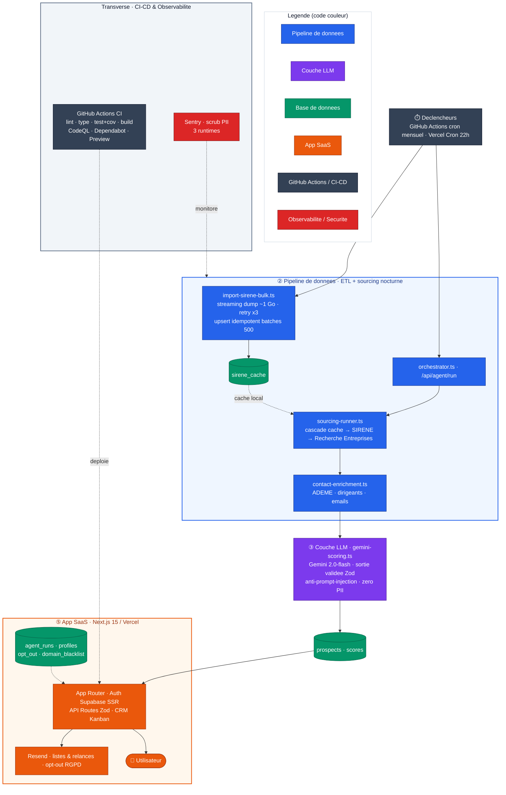
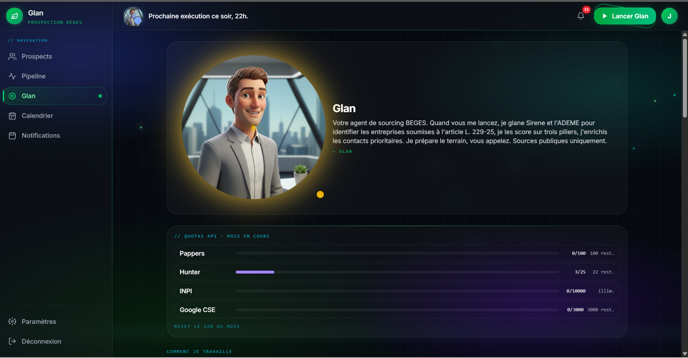
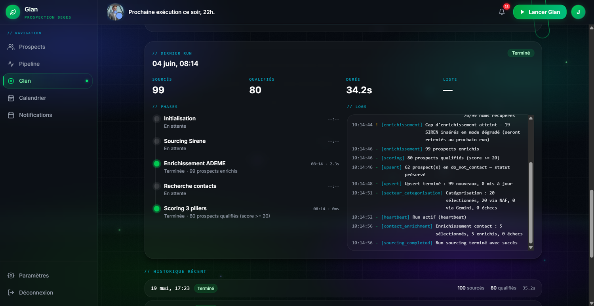
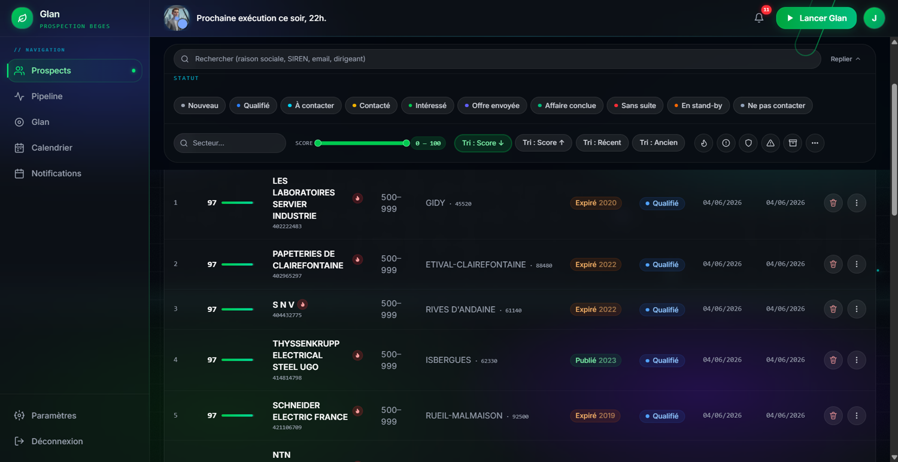
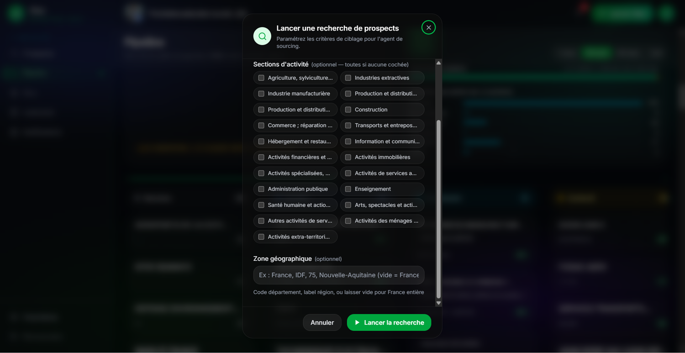
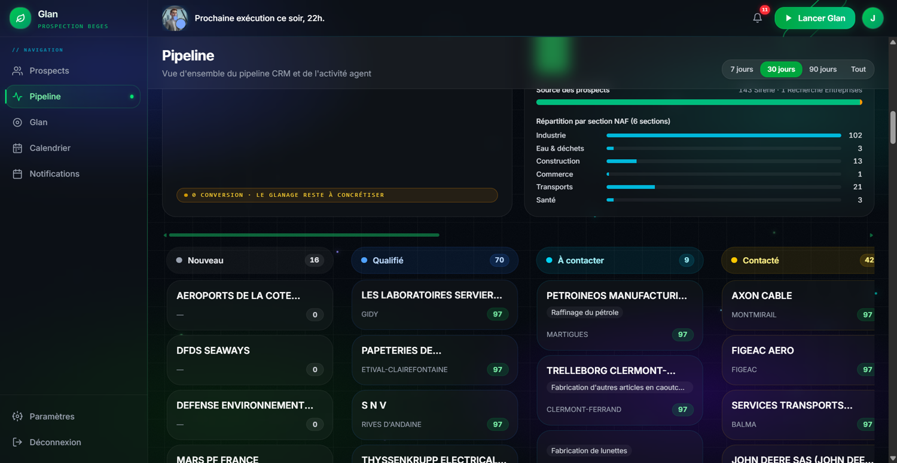
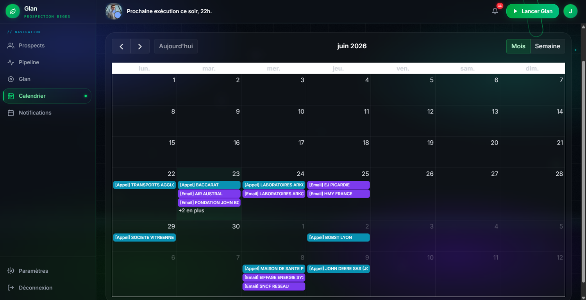
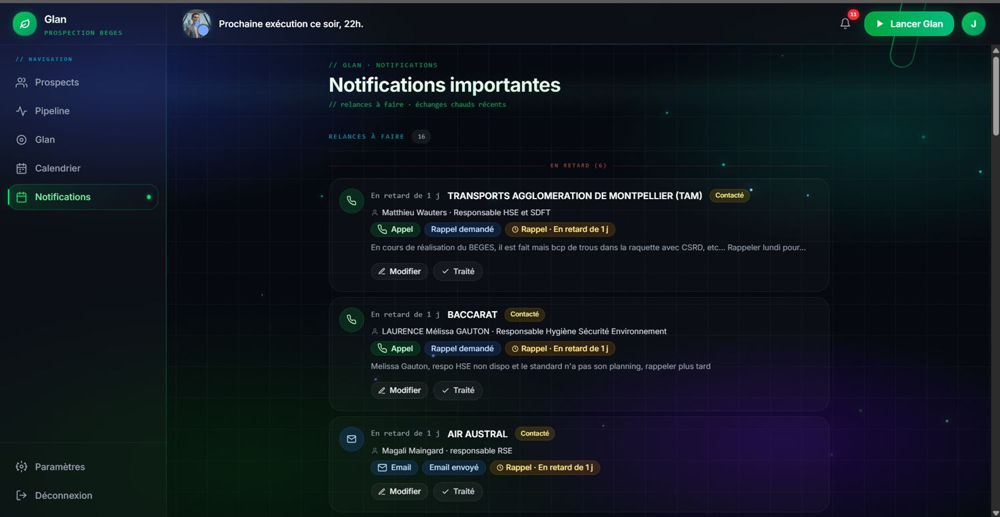
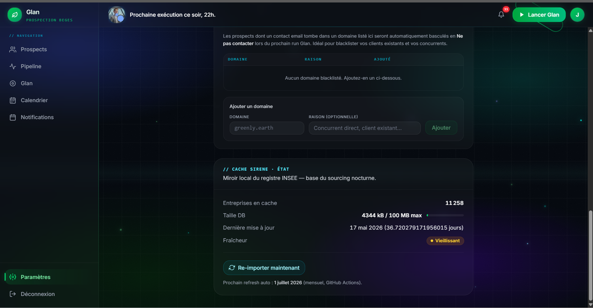

<div align="center">

# Strofe — ProspectionAgent

### Agent IA de prospection B2B « bilan carbone / BEGES » — du registre SIRENE au CRM commercial qualifié

De la donnée publique brute (SIRENE INSEE) à un CRM Kanban qualifié : ETL en streaming, sourcing nocturne automatisé, enrichissement multi-sources, scoring LLM **évalué** et **gates de qualité de données** sur chaque run.

**Un outil que je construis et fais tourner en production chez Strofe** — ETL idempotent & pipelines, PostgreSQL avancé (RLS multi-tenant), LLM en production **avec eval harness & métriques (MAE)**, data-quality gates, observabilité, CI/CD.

[](https://github.com/anbsamsam17/Strofe_ProspectionAgent/actions)
[](https://nextjs.org/)
[](https://react.dev/)
[](https://www.typescriptlang.org/)
[](https://supabase.com/)
[](https://vercel.com/)
[](https://sentry.io/)
[](https://vitest.dev/)
[](lib/agent/__evals__/README.md)
[](lib/agent/data-quality.ts)
[](#licence)

</div>

> ## 🟢 Statut : **en production**
> Application déployée sur Vercel et utilisée au quotidien par des consultants BEGES ; pipeline nocturne et import SIRENE mensuel opérationnels.

---

## Ce que fait l'outil

**ProspectionAgent** transforme un consultant en bilan carbone en machine de prospection : chaque nuit, l'agent source les entreprises françaises soumises à l'obligation BEGES depuis le registre **SIRENE**, les enrichit (données ADEME, contacts), les score via un LLM, puis alimente un **CRM Kanban** de prospects qualifiés et priorisés, prêts à appeler.

**À qui ça sert :** consultants et cabinets RSE / décarbonation qui veulent un flux régulier de prospects qualifiés sans passer leurs journées à chercher des SIRET dans des fichiers Excel.

---

## Impact & résultats

Résultats d'ingénierie, vérifiables dans le code et les migrations (aucun KPI client inventé) :

- **Dump SIRENE ~1 Go traité en streaming** — le fichier n'est jamais chargé en mémoire, l'import reste en **O(1) mémoire** quel que soit le volume (`scripts/import-sirene-bulk.ts`).
- **Upsert idempotent par batches de 500** — l'ETL est **rejouable** sans corrompre la base (`onConflict: 'siren'`), avec **retry exponentiel ×3** sur 5xx / timeout.
- **Observabilité data-quality** — chaque ligne rejetée est comptée et **catégorisée par cause** (10 causes), avec un mode `DRY_RUN` qui parse et reporte sans rien écrire.
- **3 sources en cascade** au sourcing nocturne — cache local SIRENE → API SIRENE INSEE → Recherche Entreprises, avec curseur de pagination persisté et circuit breaker.
- **Scoring LLM contraint** — sortie du modèle **validée par Zod** avant écriture, avec fallback propre en cas de réponse non conforme.
- **Automatisation planifiée** — **cron nocturne** (sourcing 22h, `reap-stale` 4h, purge 3h) + **ETL SIRENE mensuel** (1er du mois) via GitHub Actions avec freshness-check.
- **Scoring LLM évalué (eval harness)** — le scoring Gemini est mesuré sur un golden set : **MAE**, **% within-range**, conformité des raisons, respect de l'ordre métier. Tourne **offline en CI** + live (`npm run eval:llm`).
- **Data-quality gates par run** — 5 contrôles non-fatals (volume sourcé, taux sans contact / sans BEGES, match ADEME, chute vs run précédent) → statut `ok/warn/critical` dans `agent_runs.logs`.
- **32 migrations Postgres versionnées** — du schéma initial à la dernière évolution (`001_initial` → `032_pipeline_metrics`), RLS multi-tenant sur toutes les tables métier.
- **1 459 tests Vitest (101 fichiers)** — transformations de données, mapping SIRENE, scoring, data-quality et helpers d'observabilité, avec coverage générée en CI.

---

## Architecture end-to-end



### Data lineage

Parcours d'une donnée, du registre public INSEE jusqu'à la fiche prospect du CRM :

```mermaid
flowchart LR
    INSEE["SIRENE INSEE<br/>dump bulk ~1 Go"]
    IMPORT["import-sirene-bulk.ts<br/>streaming + upsert batches 500"]
    CACHE["sirene_cache<br/>table Postgres"]
    SRC["sourcing-runner.ts<br/>cascade nocturne"]
    ENR["contact-enrichment.ts<br/>ADEME + contacts"]
    SCORE["gemini-scoring.ts<br/>Gemini 2.0-flash + Zod"]
    PROSPECTS["prospects<br/>table Postgres RLS"]
    CRM["CRM Kanban<br/>pipeline commercial"]

    INSEE -->|import mensuel idempotent| IMPORT
    IMPORT -->|onConflict siren| CACHE
    CACHE -->|sourcing nocturne 22h| SRC
    SRC -->|features sans PII| ENR
    ENR -->|scoring 3 piliers| SCORE
    SCORE -->|upsert prospects scores| PROSPECTS
    PROSPECTS -->|filtre par RLS auth.uid| CRM

    classDef src fill:#0f2e1d,stroke:#34d399,stroke-width:2px,color:#d1fae5;
    classDef llm fill:#1e1b4b,stroke:#818cf8,stroke-width:2px,color:#e0e7ff;
    class INSEE,IMPORT,CACHE,SRC,ENR src;
    class SCORE llm;
```



---

## Les briques du système

| Brique | Ce qui est mis en œuvre | Domaine |
| --- | --- | --- |
| **Qualité & éval data** | Eval harness LLM (MAE, golden set), 5 data-quality gates par run, vue analytique `pipeline_metrics_daily` | **Data quality / Observabilité** |
| **32 migrations Supabase** | RLS multi-tenant (`auth.uid() = user_id`), `UNIQUE(user_id, siren)`, colonnes `GENERATED ALWAYS`, RPC `SECURITY DEFINER`, vue `security_invoker`, index GIN / full-text FR | **BDD** |
| **ETL SIRENE** | Streaming d'un dump ~1 Go, retry ×3, upsert idempotent par batches de 500, mode `DRY_RUN`, observabilité par cause de rejet | **Pipeline data** |
| **Pipeline nocturne** | Orchestrateur cron → sourcing en cascade → enrichissement → scoring LLM validé par Zod → upsert | **Pipeline data** |
| **4 workflows GitHub Actions** | CI (lint/typecheck/test+coverage/build), CodeQL, Deploy Preview Vercel, import SIRENE mensuel avec freshness-check | **DevOps / CI-CD** |
| **Sécurité applicative** | `CRON_SECRET` timing-safe, service_role serveur-only, Zod aux frontières, scrub PII Sentry sur 3 runtimes | **SaaS / Sécurité** |
| **CRM end-to-end** | Auth, Kanban drag-and-drop, calendrier de rappels, RGPD (opt-out HMAC, art. 14) | **SaaS end-to-end** |
| **1 459 tests Vitest** | Transformations de données, mapping SIRENE, scoring, data-quality, helpers d'observabilité + eval harness LLM offline en CI | **Qualité / Tests** |

---

## Base de données — Postgres avancé, multi-tenant

- **Isolation stricte par locataire** : chaque table métier porte une politique **RLS** `auth.uid() = user_id` (SELECT / INSERT / UPDATE / DELETE). Les requêtes côté utilisateur (client SSR) sont filtrées par la base, pas par le code — pas de `.eq('user_id', …)` redondant.
- **32 migrations versionnées** retraçant l'évolution réelle du schéma (`001_initial` → `032_pipeline_metrics`).
- **Patterns Postgres avancés réellement utilisés** :
  - colonnes **`GENERATED ALWAYS`** (ex. score composite *hot lead*, migration 024),
  - fonction **RPC `SECURITY DEFINER`** pour la recherche SIRENE (migration 019),
  - **index GIN / full-text** adaptés au français pour la recherche d'entreprises,
  - contrainte d'idempotence **`UNIQUE(user_id, siren)`**.
- **Modèle de données** : `profiles` (extension `auth.users`, settings JSONB + curseur de sourcing), `prospects` (identité SIRENE + BEGES + score composite + scoring Gemini + statut CRM), `prospect_contacts` / `prospect_exchanges` (contacts enrichis + historique des échanges), `agent_runs` (journal du cron), `sirene_cache` (cache local du registre). Les tables `daily_lists` / `daily_list_items` ont été retirées au pivot (migration `014_drop_daily_lists_and_rename.sql`).
- **3 clients Supabase** distincts : browser (anon), SSR (anon + cookies), admin (service_role, serveur uniquement).

### Points forts base de données

- **Colonne `GENERATED ALWAYS … STORED`** : le flag *hot lead* est calculé **dans la base** à chaque `UPDATE`, jamais en code — garantit la cohérence UI / agent et alimente un index partiel `WHERE is_hot_lead = TRUE` (`supabase/migrations/024_hot_lead_composite.sql:39`).
- **RPC `SECURITY DEFINER` + `STABLE`** `search_sirene_cache(...)` : encapsule tout le sourcing multi-critères (NAF, tranche, plage CP, dedup SIREN) en un appel SQL unique et bypasse la ré-évaluation RLS par ligne (`supabase/migrations/019_sirene_search_function.sql:95`).
- **Index GIN trigram (`pg_trgm`) + full-text français** : recherche `ILIKE` sur `secteur_libelle` (`supabase/migrations/003_perf_indexes.sql:29`) et `to_tsvector('french', …)` sur `raison_sociale` (`supabase/migrations/019_sirene_search_function.sql:82`).
- **ENUMs étendus par `ALTER TYPE … ADD VALUE IF NOT EXISTS`** : évolution non destructive des statuts au fil des besoins (`supabase/migrations/010_prospect_status_offer_sent.sql:27`, `017_do_not_contact_status.sql:51`, `028_status_to_contact.sql:48`, `007_call_result_extended.sql:29`).
- **RLS multi-tenant à 4 policies + contrainte d'idempotence** : SELECT / INSERT / UPDATE / DELETE en `auth.uid() = user_id` plus `UNIQUE(user_id, siren)` sur `prospects` (`supabase/migrations/001_initial.sql:261` et `326`-`341`).

---

## Pipeline de données

**ETL SIRENE mensuel** (`scripts/import-sirene-bulk.ts`)
- Lecture en **streaming** d'un dump compressé ~1 Go (jamais chargé en mémoire),
- **retry ×3** sur erreurs réseau, **upsert idempotent** par **batches de 500**,
- mode **`DRY_RUN`** pour valider sans écrire,
- **observabilité par cause de rejet** (lignes ignorées comptées et catégorisées).

**Pipeline nocturne** (`/api/agent/run`, Vercel Cron 22h)
- Garde **`CRON_SECRET`** vérifié en **timing-safe** (`crypto.timingSafeEqual`),
- → **orchestrateur** → **sourcing en cascade** (cache local → SIRENE → Recherche Entreprises) → **enrichissement ADEME / contacts** → **scoring Gemini** (`gemini-2.0-flash`, sortie JSON validée par **Zod**, fallback propre) → **upsert** dans `prospects`,
- **logs structurés JSON** persistés dans `agent_runs.logs`,
- crons complémentaires : `reap-stale` (4h) et `purge-prospects` (3h).

### Points forts pipeline data

- **Observabilité data-quality** : chaque ligne rejetée à l'import SIRENE est comptée et **catégorisée par cause** (10 causes : `etat`, `siege`, `tranche_missing/excluded`, `naf_missing/excluded`, `siren_missing/format`, `siret_missing/format`), avec un mode **`DRY_RUN`** qui parse et reporte sans rien écrire (`scripts/import-sirene-bulk.ts:261` et `:93`).
- **Idempotence** : upsert `onConflict: 'siren'` par **batches de 500**, rejouable sans corrompre la base (`scripts/import-sirene-bulk.ts:360` et `:80`).
- **Résilience** : **retry exponentiel ×3** sur 5xx / timeout au download (`scripts/import-sirene-bulk.ts:508`), **garde-fou storage** (ABORT au-delà du quota) et abandon immédiat sur 4xx non-retryable (`scripts/import-sirene-bulk.ts:525`).
- **Reprise & robustesse du sourcing nocturne** : **curseur de pagination persisté** dans `profiles.sourcing_state` (invalidé si la signature des filtres change), **circuit breaker** sur l'enrichissement téléphone et **heartbeat 30 s** poussé dans `agent_runs.logs` (`lib/agent/sourcing-runner.ts:7`, `:37`, `:201`).

---

## Qualité, évaluation & observabilité du pipeline

> La différence entre « un pipeline qui tourne » et « un système data mesuré et amélioré ».
> Détail : **[docs/data-architecture.md](docs/data-architecture.md)**.

### Eval harness LLM — *mesurer la qualité du scoring, pas l'espérer*

Le scoring commercial Gemini est évalué sur un **golden set de 18 cas sans PII** couvrant tout le spectre (`lib/agent/__fixtures__/golden-prospects.json`), via un harness isolé de la CI unitaire (`npm run eval:llm`).

- **Mode live** (`GEMINI_API_KEY`) : **MAE** sur `interet_score` vs centre de la fourchette attendue, **% within-range**, **conformité sémantique des raisons**, **respect de l'ordre métier** ROI / image → légal.
- **Mode offline déterministe** (CI, zéro réseau) : intégrité des fixtures, builder de prompt (faits réglementaires figés, **zéro fuite PII**), schéma Zod réel.

> Dernier run live tenté le 2026-08-05 : interrompu par le quota de l'API Gemini (HTTP 429, free tier `gemini-2.0-flash` épuisé) — aucun chiffre n'est publié tant qu'un run live complet n'a pas abouti. Au premier run complet, les métriques mesurées (MAE, within-range, conformité, n = 18) seront publiées ici et le rapport commité dans `lib/agent/__evals__/last-report.json`.

Code : `lib/agent/__evals__/`.

### Data-quality gates — *alerter sur une dégradation au lieu de la subir*

Phase **non-fatale** et **pure** (zéro I/O) en fin de pipeline : `runDataQualityChecks()` agrège 5 expectations PII-free et renvoie un statut `ok | warn | critical` loggué dans `agent_runs.logs`.

| Gate | Détecte |
| --- | --- |
| `SOURCED_VOLUME` | volume sourcé effondré (pipeline cassé) |
| `SANS_CONTACT_RATE` | cascade d'enrichissement contact en échec |
| `SANS_BEGES_RATE` | enrichissement ADEME massivement KO |
| `ADEME_MATCH_RATE` | taux de match BEGES anormalement nul |
| `DROP_VS_PREVIOUS` | chute brutale vs run précédent du même utilisateur |

Code : `lib/agent/data-quality.ts`.

### Métriques de pipeline — *vue SQL analytique, RLS-safe*

Vue `pipeline_metrics_daily` (1 ligne par jour × utilisateur) : runs total / réussis / échoués, `success_rate`, sourcés / qualifiés, `qualification_rate`, durée **moyenne et médiane** (`PERCENTILE_CONT`). `security_invoker = true` → hérite de la RLS d'`agent_runs`, **aucune fuite cross-tenant**.

Code : `supabase/migrations/032_pipeline_metrics.sql`.

### EDA data-driven — *justifier les seuils de scoring par la donnée*

Notebook Jupyter + scripts Python reproductibles (`analysis/`) validant les seuils et poids de `lib/agent/scoring.ts` sur un dataset synthétique réaliste : seuils de taille indexés sur le seuil légal (500 salariés), poids 30/30/40 validés, score peu corrélé à la seule taille (**Spearman ρ ≈ 0,55**). **Limite assumée** : dataset synthétique → cohérence interne, pas pouvoir prédictif ; étape suivante = corréler aux `call_result` réels.

Détail : `analysis/README.md`.

---

## CI/CD & GitHub Actions

| Workflow | Déclencheur | Rôle |
| --- | --- | --- |
| **`ci.yml`** | push `main`/`develop`, PR `main` | `lint` · `type-check` · `test:coverage` (artifact uploadé) · **`eval:llm` (eval harness offline)** · `build` (avec cache `.next`). Jobs parallèles + `concurrency` cancel-in-progress. |
| **`codeql.yml`** | cron hebdo + push/PR `main` | Analyse statique de sécurité CodeQL (JavaScript/TypeScript). |
| **`deploy-preview.yml`** | PR `main` | Tests en *gate* avant déploiement preview Vercel. |
| **`sirene-import.yml`** | cron mensuel (1er à 04h UTC) + `workflow_dispatch` | Import SIRENE via **GitHub Environment** (secrets injectés), **freshness-check** (skip si cache < 25j, `force` possible), timeout 60 min, Node 22. |

---

## Application SaaS

- **Stack** : Next.js **15** (App Router, Turbopack) · React **19** · TypeScript **5** strict · Tailwind CSS **v4** · `next-themes` (dark mode).
- **CRM Kanban** : pipeline drag-and-drop (`@dnd-kit`), **file de prospects priorisés**, **calendrier de rappels** (`@fullcalendar`), saisie des résultats d'appel par l'humain.
- **Emails transactionnels** : **Resend** + `@react-email/components` (« votre liste est prête »).
- **RGPD** : footer **article 14**, **opt-out** via token **HMAC**, **scrub PII** Sentry sur les **3 runtimes** (client / server / edge), purge automatique des prospects.
- **Observabilité** : Sentry (`@sentry/nextjs` v9), `beforeSend` qui retire emails / téléphones des prospects.

---

## Tests

- **1 459 tests Vitest sur 101 fichiers** (`vitest run`, jsdom, `@testing-library/react`).
- Couverture des **transformations de données** (mapping SIRENE, sourcing), du **scoring**, des **helpers d'observabilité** et des règles métier (blacklist, hot-lead, décret 2022, BEGES).
- **Coverage** générée en CI (`test:coverage`) et publiée en artifact.

---

## Aperçu

> Captures de l'application en production. Les entreprises affichées sont des données **publiques** (base SIRENE/INSEE), aucune donnée confidentielle client.

### L'agent IA « Glan » — sourcing & scoring nocturnes

L'agent qui tourne chaque nuit : sourcing en cascade, enrichissement multi-sources et scoring LLM, livrés au matin.



*La console de l'agent : mission, prochaine exécution (cron 22h), lancement manuel et consommation des quotas par source d'enrichissement.*



*Analyse d'un run : métriques (entreprises sourcées, prospects qualifiés, durée), timeline des étapes du pipeline et logs structurés persistés dans `agent_runs`.*

### CRM & prospects



*Tableau de bord des prospects : score IA 0-100, statut BEGES (échéance d'obligation), filtres composables par statut CRM et secteur, tri par score ou récence.*



*Recherche de prospects à la demande : ciblage par secteurs d'activité et zone géographique pour piloter le sourcing de l'agent.*



*Pipeline Kanban (drag-and-drop) : vue d'ensemble du flux commercial, taux de conversion et répartition des prospects par section NAF.*

### Suivi commercial



*Calendrier de rappels : planification des appels et emails de relance, vue mois / semaine.*



*Notifications & relances : rappels en retard mis en avant, contacts qualifiés (persona) et suivi des appels / emails.*

### Configuration



*Configuration : blacklist de domaines (« ne pas contacter ») et état du cache SIRENE local alimentant le sourcing nocturne (volume, fraîcheur, ré-import à la demande).*

---

## Démarrer

```bash
# 1. Installer les dépendances
npm install

# 2. Configurer l'environnement
cp .env.example .env.local   # puis renseigner Supabase, INSEE, Gemini, Resend, Sentry, CRON_SECRET

# 3. Lancer en développement (Turbopack)
npm run dev                  # http://localhost:3000

# Qualité
npm run lint
npm run type-check
npm test                     # vitest run
npm run test:coverage

# Build production
npm run build

# Import SIRENE (ETL)
npm run import-sirene        # respecte DRY_RUN

# Migrations Supabase
npx supabase migration new <nom>
npx supabase db push
```

---

## Documentation technique

Documentation d'ingénierie maintenue dans le dépôt :

- **[docs/data-pipeline.md](docs/data-pipeline.md)** — anatomie de l'ETL SIRENE et du pipeline nocturne : streaming, idempotence, cascade de sourcing, scoring.
- **[docs/cicd.md](docs/cicd.md)** — les workflows GitHub Actions (CI, deploy preview, import SIRENE mensuel) et leur configuration.
- **[docs/SECURITY-RLS.md](docs/SECURITY-RLS.md)** — modèle d'isolation multi-tenant : politiques RLS `auth.uid() = user_id` table par table.
- **[SECURITY.md](SECURITY.md)** — politique de sécurité, gestion des secrets et procédure de signalement de vulnérabilité.
- **[docs/data-architecture.md](docs/data-architecture.md)** — couche qualité / évaluation / observabilité : eval harness LLM (MAE, golden set), data-quality gates, vue `pipeline_metrics_daily`, contrats de données Zod par source.
- **[supabase/migrations/README.md](supabase/migrations/README.md)** — historique et conventions des 32 migrations Postgres.
- **[docs/sirene-cache-deployment-checklist.md](docs/sirene-cache-deployment-checklist.md)** — checklist de déploiement et de mise en service du cache SIRENE.

---

## Auteur

**Samir Anbri** — [samir.anbri@gmail.com](mailto:samir.anbri@gmail.com) · [LinkedIn](https://www.linkedin.com/in/samir-anbri/) · GitHub [@anbsamsam17](https://github.com/anbsamsam17)

## Licence

Propriétaire — tous droits réservés. Réutilisation, reproduction ou usage commercial soumis à autorisation écrite préalable (voir [LICENSE](LICENSE)).
