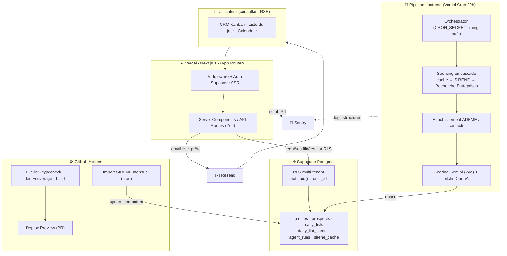
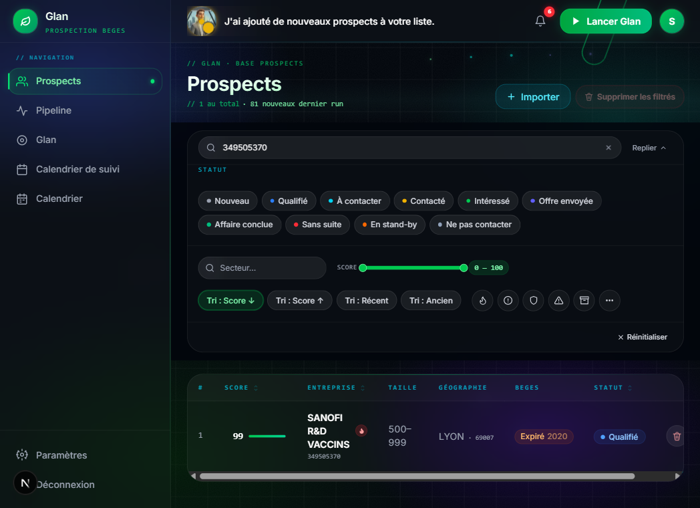
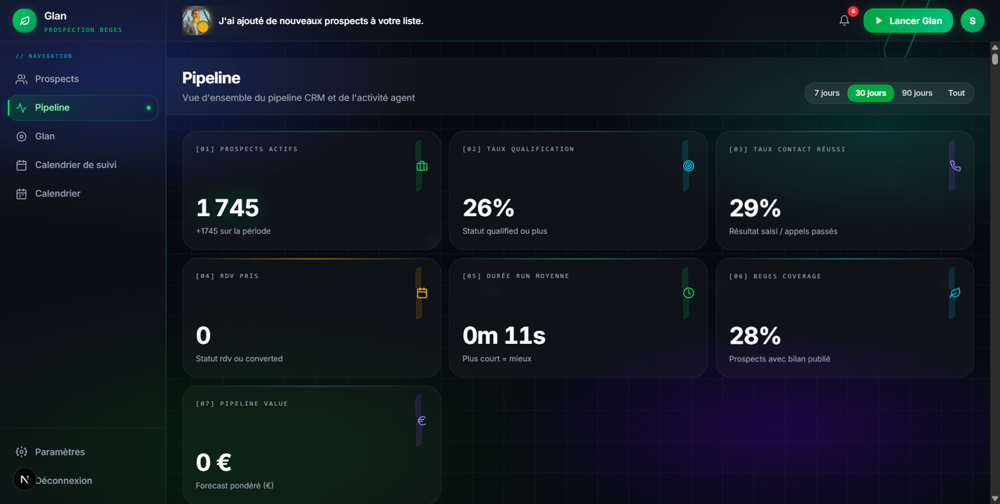
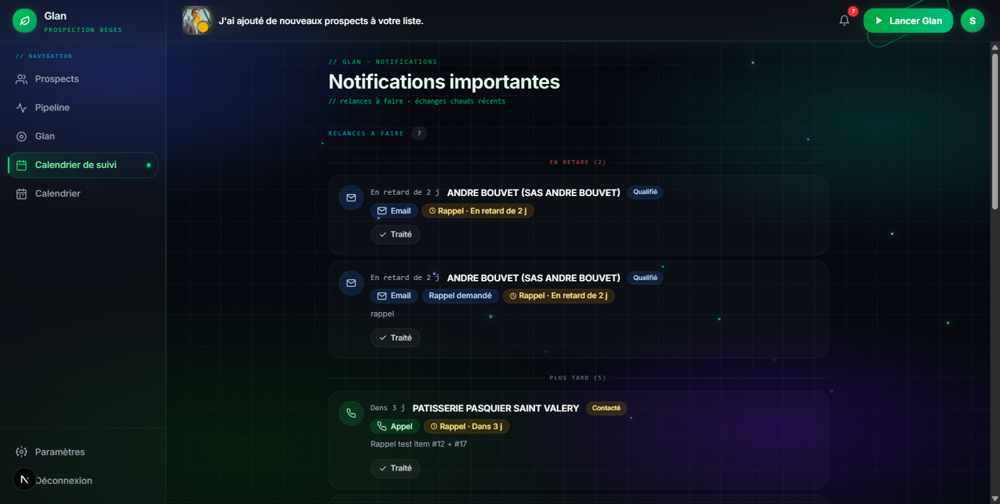

<div align="center">

# Strofe — ProspectionAgent

### Agent IA de prospection B2B « bilan carbone / BEGES » — du registre SIRENE à la liste d'appels du jour

De la donnée publique brute (SIRENE INSEE) à un CRM Kanban qualifié : sourcing nocturne automatisé, enrichissement multi-sources, scoring LLM et livraison quotidienne de prospects priorisés.

[](https://github.com/anbsamsam17/Strofe_ProspectionAgent/actions)
[](https://nextjs.org/)
[](https://react.dev/)
[](https://www.typescriptlang.org/)
[](https://supabase.com/)
[](https://vercel.com/)
[](https://sentry.io/)
[](https://vitest.dev/)
[](#licence)

</div>

> ## 🟢 Statut : **en production** · **2 clients payants**
> Application déployée sur Vercel, pipeline nocturne et import SIRENE mensuel opérationnels.

---

## Le pitch

**ProspectionAgent** transforme un consultant en bilan carbone en machine de prospection : chaque nuit, l'agent source les entreprises françaises soumises à l'obligation BEGES depuis le registre **SIRENE**, les enrichit (données ADEME, contacts), les score via un LLM, puis livre au matin une **liste d'appels priorisés** prête à exploiter dans un **CRM Kanban**.

**À qui ça sert :** consultants et cabinets RSE / décarbonation qui veulent un flux régulier de prospects qualifiés sans passer leurs journées à chercher des SIRET dans des fichiers Excel.

---

## Architecture end-to-end



---

## Ce que ce repo démontre

| Brique | Ce qui est mis en œuvre | Compétence |
| --- | --- | --- |
| **28 migrations Supabase** | RLS multi-tenant (`auth.uid() = user_id`), `UNIQUE(user_id, siren)`, colonnes `GENERATED ALWAYS`, RPC `SECURITY DEFINER`, index GIN / full-text FR | **BDD** |
| **ETL SIRENE** | Streaming d'un dump ~1 Go, retry ×3, upsert idempotent par batches de 500, mode `DRY_RUN`, observabilité par cause de rejet | **Pipeline data** |
| **Pipeline nocturne** | Orchestrateur cron → sourcing en cascade → enrichissement → scoring LLM validé par Zod → upsert | **Pipeline data** |
| **3 workflows GitHub Actions** | CI (lint/typecheck/test+coverage/build), Deploy Preview Vercel, import SIRENE mensuel avec freshness-check | **DevOps / CI-CD** |
| **Sécurité applicative** | `CRON_SECRET` timing-safe, service_role serveur-only, Zod aux frontières, scrub PII Sentry sur 3 runtimes | **SaaS / Sécurité** |
| **CRM end-to-end** | Auth, Kanban drag-and-drop, calendrier de rappels, RGPD (opt-out HMAC, art. 14) | **SaaS end-to-end** |
| **~99 suites Vitest** | Transformations de données, mapping SIRENE, scoring, helpers d'observabilité | **Qualité / Tests** |

---

## 🗄️ Base de données — Postgres avancé, multi-tenant

- **Isolation stricte par locataire** : chaque table métier porte une politique **RLS** `auth.uid() = user_id` (SELECT / INSERT / UPDATE / DELETE). Les requêtes côté utilisateur (client SSR) sont filtrées par la base, pas par le code — pas de `.eq('user_id', …)` redondant.
- **28 migrations versionnées** retraçant l'évolution réelle du schéma (`001_initial` → `028_status_to_contact`).
- **Patterns Postgres avancés réellement utilisés** :
  - colonnes **`GENERATED ALWAYS`** (ex. score composite *hot lead*, migration 024),
  - fonction **RPC `SECURITY DEFINER`** pour la recherche SIRENE (migration 019),
  - **index GIN / full-text** adaptés au français pour la recherche d'entreprises,
  - contrainte d'idempotence **`UNIQUE(user_id, siren)`**.
- **Modèle de données** : `profiles` (extension `auth.users`, settings JSONB), `prospects` (identité SIRENE + BEGES + score + statut CRM), `daily_lists` / `daily_list_items` (la liste d'appels du jour), `agent_runs` (journal du cron), `sirene_cache` (cache local du registre).
- **3 clients Supabase** distincts : browser (anon), SSR (anon + cookies), admin (service_role, serveur uniquement).

### ⭐ Points forts base de données

- **Colonne `GENERATED ALWAYS … STORED`** : le flag *hot lead* est calculé **dans la base** à chaque `UPDATE`, jamais en code — garantit la cohérence UI / agent et alimente un index partiel `WHERE is_hot_lead = TRUE` (`supabase/migrations/024_hot_lead_composite.sql:39`).
- **RPC `SECURITY DEFINER` + `STABLE`** `search_sirene_cache(...)` : encapsule tout le sourcing multi-critères (NAF, tranche, plage CP, dedup SIREN) en un appel SQL unique et bypasse la ré-évaluation RLS par ligne (`supabase/migrations/019_sirene_search_function.sql:95`).
- **Index GIN trigram (`pg_trgm`) + full-text français** : recherche `ILIKE` sur `secteur_libelle` (`supabase/migrations/003_perf_indexes.sql:29`) et `to_tsvector('french', …)` sur `raison_sociale` (`supabase/migrations/019_sirene_search_function.sql:82`).
- **ENUMs étendus par `ALTER TYPE … ADD VALUE IF NOT EXISTS`** : évolution non destructive des statuts au fil des besoins (`supabase/migrations/010_prospect_status_offer_sent.sql:27`, `017_do_not_contact_status.sql:51`, `028_status_to_contact.sql:48`, `007_call_result_extended.sql:29`).
- **RLS multi-tenant à 4 policies + contrainte d'idempotence** : SELECT / INSERT / UPDATE / DELETE en `auth.uid() = user_id` plus `UNIQUE(user_id, siren)` sur `prospects` (`supabase/migrations/001_initial.sql:261` et `326`-`341`).

---

## 🔄 Pipeline de données

**ETL SIRENE mensuel** (`scripts/import-sirene-bulk.ts`)
- Lecture en **streaming** d'un dump compressé ~1 Go (jamais chargé en mémoire),
- **retry ×3** sur erreurs réseau, **upsert idempotent** par **batches de 500**,
- mode **`DRY_RUN`** pour valider sans écrire,
- **observabilité par cause de rejet** (lignes ignorées comptées et catégorisées).

**Pipeline nocturne** (`/api/agent/run`, Vercel Cron 22h)
- Garde **`CRON_SECRET`** vérifié en **timing-safe** (`crypto.timingSafeEqual`),
- → **orchestrateur** → **sourcing en cascade** (cache local → SIRENE → Recherche Entreprises) → **enrichissement ADEME / contacts** → **scoring Gemini** (`gemini-2.0-flash`, sortie JSON validée par **Zod**, fallback propre) + génération de **pitchs OpenAI `gpt-4o`** → **upsert** dans `prospects` / `daily_list_items`,
- **logs structurés JSON** persistés dans `agent_runs.logs`,
- crons complémentaires : `reap-stale` (4h) et `purge-prospects` (3h).

### ⭐ Points forts pipeline data

- **Observabilité data-quality** : chaque ligne rejetée à l'import SIRENE est comptée et **catégorisée par cause** (10 causes : `etat`, `siege`, `tranche_missing/excluded`, `naf_missing/excluded`, `siren_missing/format`, `siret_missing/format`), avec un mode **`DRY_RUN`** qui parse et reporte sans rien écrire (`scripts/import-sirene-bulk.ts:257` et `:88`).
- **Idempotence** : upsert `onConflict: 'siren'` par **batches de 500**, rejouable sans corrompre la base (`scripts/import-sirene-bulk.ts:350` et `:80`).
- **Résilience** : **retry exponentiel ×3** sur 5xx / timeout au download (`scripts/import-sirene-bulk.ts:509`), **garde-fou storage** (ABORT au-delà du quota) et abandon immédiat sur 4xx non-retryable (`scripts/import-sirene-bulk.ts:513`).
- **Reprise & robustesse du sourcing nocturne** : **curseur de pagination persisté** dans `profiles.sourcing_state` (invalidé si la signature des filtres change), **circuit breaker** sur l'enrichissement téléphone et **heartbeat 30 s** poussé dans `agent_runs.logs` (`lib/agent/sourcing-runner.ts:7`, `:37`, `:202`).

---

## ⚙️ CI/CD & GitHub Actions

| Workflow | Déclencheur | Rôle |
| --- | --- | --- |
| **`ci.yml`** | push `main`/`develop`, PR `main` | `lint` · `type-check` · `test:coverage` (artifact uploadé) · `build` (avec cache `.next`). Jobs parallèles + `concurrency` cancel-in-progress. |
| **`deploy-preview.yml`** | PR `main` | Tests en *gate* avant déploiement preview Vercel. |
| **`sirene-import.yml`** | cron mensuel (1er à 04h UTC) + `workflow_dispatch` | Import SIRENE via **GitHub Environment** (secrets injectés), **freshness-check** (skip si cache < 25j, `force` possible), timeout 60 min, Node 22. |

---

## 🚀 Application SaaS

- **Stack** : Next.js **15** (App Router, Turbopack) · React **19** · TypeScript **5** strict · Tailwind CSS **v4** · `next-themes` (dark mode).
- **CRM Kanban** : pipeline drag-and-drop (`@dnd-kit`), **liste d'appels du jour**, **calendrier de rappels** (`@fullcalendar`), saisie des résultats d'appel par l'humain.
- **Emails transactionnels** : **Resend** + `@react-email/components` (« votre liste est prête »).
- **RGPD** : footer **article 14**, **opt-out** via token **HMAC**, **scrub PII** Sentry sur les **3 runtimes** (client / server / edge), purge automatique des prospects.
- **Observabilité** : Sentry (`@sentry/nextjs` v9), `beforeSend` qui retire emails / téléphones des prospects.

---

## ✅ Tests

- **~99 suites Vitest** (`vitest run`, jsdom, `@testing-library/react`).
- Couverture des **transformations de données** (mapping SIRENE, sourcing), du **scoring**, des **helpers d'observabilité** et des règles métier (blacklist, hot-lead, décret 2022, BEGES).
- **Coverage** générée en CI (`test:coverage`) et publiée en artifact.

---

## 🖼️ Aperçu

> Captures de l'application en production. Les entreprises affichées sont des données **publiques** (base SIRENE/INSEE), aucune donnée confidentielle client.

### Prospects scorés & filtrés



*Sortie du pipeline de sourcing : prospects qualifiés, score IA 0-100, statut BEGES (échéance d'obligation), 10 statuts CRM et filtres composables.*

### Tableau de bord pipeline



*Analytics du pipeline : volume de prospects, taux de qualification, temps de traitement, valeur prévisionnelle.*

### Notifications & relances



*Suivi commercial : relances email, rappels d'appels et planification au calendrier.*

---

## ▶️ Démarrer

```bash
# 1. Installer les dépendances
npm install

# 2. Configurer l'environnement
cp .env.example .env.local   # puis renseigner Supabase, INSEE, OpenAI, Gemini, Resend, Sentry, CRON_SECRET

# 3. Lancer en développement (Turbopack)
npm run dev                  # http://localhost:3000

# Qualité
npm run lint
npm run type-check
npm test                     # vitest run
npm run test:coverage

# Build production
npm run build

# Import SIRENE (ETL)
npm run import-sirene        # respecte DRY_RUN

# Migrations Supabase
npx supabase migration new <nom>
npx supabase db push
```

---

## 👤 Auteur

**Samir Anbri** — [samir.anbri@gmail.com](mailto:samir.anbri@gmail.com) · GitHub [@anbsamsam17](https://github.com/anbsamsam17)
<!-- LinkedIn : <à compléter> -->
<!-- CV : <à compléter> -->

## Licence

Propriétaire — tous droits réservés. Code de démonstration / portfolio, non destiné à la réutilisation sans autorisation.
