# Architecture data — ProspectionAgent

Vue d'ensemble du système de données : ingestion, contrats, lineage, et la couche
**qualité / évaluation / observabilité** qui distingue « un pipeline qui tourne »
de « un système data mesuré et amélioré ».

Complète [`docs/data-pipeline.md`](data-pipeline.md) (anatomie de l'ETL et du
pipeline nocturne) et [`docs/SECURITY-RLS.md`](SECURITY-RLS.md) (isolation multi-tenant).

---

## 1. Lineage — d'une donnée publique à une fiche prospect

```mermaid
flowchart LR
    INSEE["SIRENE INSEE<br/>dump bulk ~1 Go (mensuel)"]
    IMPORT["import-sirene-bulk.ts<br/>streaming · upsert idempotent (500)"]
    CACHE[("sirene_cache<br/>Postgres")]
    SRC["sourcing-runner.ts<br/>curseur paginé · cascade"]
    ADEME["ADEME BEGES<br/>publications"]
    ENR["contact-enrichment.ts<br/>RE → INPI → Pappers → Hunter"]
    SCORE_D["scoring.ts<br/>score composite 0-100 (déterministe)"]
    SCORE_L["gemini-scoring.ts<br/>intérêt 0-100 + raisons (Gemini)"]
    DQ["data-quality.ts<br/>gates qualité du run"]
    PROSPECTS[("prospects<br/>RLS auth.uid()")]
    RUNS[("agent_runs<br/>journal + métriques")]
    METRICS["pipeline_metrics_daily<br/>vue SQL agrégée"]
    CRM["CRM Kanban<br/>pipeline commercial"]

    INSEE -->|import mensuel| IMPORT --> CACHE
    CACHE -->|sourcing nocturne 22h| SRC
    SRC -->|fallback Recherche Entreprises| SRC
    ADEME -.->|enrichissement BEGES| SRC
    SRC --> ENR --> SCORE_D --> SCORE_L --> PROSPECTS
    SCORE_L --> DQ
    DQ -->|résumé PII-free| RUNS
    PROSPECTS -->|filtre RLS| CRM
    RUNS --> METRICS

    classDef src fill:#0f2e1d,stroke:#34d399,color:#d1fae5;
    classDef llm fill:#1e1b4b,stroke:#818cf8,color:#e0e7ff;
    classDef q   fill:#3b1d0f,stroke:#fb923c,color:#fed7aa;
    class INSEE,IMPORT,CACHE,SRC,ADEME,ENR,SCORE_D src;
    class SCORE_L llm;
    class DQ,METRICS q;
```

---

## 2. Contrats de données (validation aux frontières)

Toute réponse d'API externe est **parsée par un schéma Zod** avant usage : une `200`
mal formée échoue proprement (et déclenche un `schema_drift` Sentry) plutôt que de
propager des données corrompues.

| Source | Rôle | Contrat | Fraîcheur / SLA |
|---|---|---|---|
| **SIRENE INSEE (bulk)** | Univers d'entreprises | Parsing CSV stream + comptage par cause de rejet | Ré-import mensuel ; cache stale > 60j → fallback |
| **SIRENE INSEE (API)** | Sourcing à la demande | Zod sur la réponse recherche | OAuth2, token 7j |
| **Recherche Entreprises (gouv)** | Fallback sourcing + contact | Zod | Best-effort, circuit breaker |
| **ADEME BEGES** | État de l'obligation carbone | Zod, batch de 20 | Enrichissement par run |
| **Pappers / Hunter / INPI** | Contacts (cascade) | Zod par source | Quotas persistés, désactivation sur 401 |
| **Google Gemini** | Scoring commercial | **structured output natif + re-validation Zod** | Timeout 15s, retry 1, fallback `transient_failure` |

---

## 3. Propriétés d'ingénierie data

- **O(1) mémoire** — le dump SIRENE ~1 Go est lu en streaming, jamais chargé en RAM
  (`scripts/import-sirene-bulk.ts`).
- **Idempotence** — upsert `onConflict: 'siren'` par batches de 500 ; l'ETL et le
  sourcing sont rejouables sans corrompre la base (`UNIQUE(user_id, siren)`).
- **Reprise** — curseur de pagination persisté dans `profiles.sourcing_state`,
  invalidé si la signature des filtres change ; survit aux timeouts Vercel.
- **Résilience** — retry exponentiel ×3 (download), circuit breakers (enrichissement
  téléphone, Pappers 401), heartbeat 30s dans `agent_runs.logs`.
- **Observabilité de rejet** — chaque ligne ignorée à l'import est comptée et
  **catégorisée** (10 causes), mode `DRY_RUN` qui parse sans écrire.

---

## 4. Couche qualité / évaluation / observabilité

Trois artefacts dédiés, au-delà du simple « ça tourne » :

### 4.1 Eval harness LLM — `lib/agent/__evals__/`
Évalue le **scoring commercial Gemini** sur un golden set (`lib/agent/__fixtures__/golden-prospects.json`,
18 cas sans PII couvrant les extrêmes) :
- **Mode live** (`GEMINI_API_KEY` présent) : **MAE** sur `interet_score`, **% within-range**,
  **taux de conformité** des raisons, **respect de l'ordre** ROI → image → légal.
- **Mode offline déterministe** (CI) : intégrité des fixtures, builder de prompt
  (faits réglementaires présents, **zéro PII**), schéma Zod réel.
- Lancement : `npm run eval:llm` (config isolée `vitest.evals.config.ts` — n'impacte
  pas la couverture des tests unitaires).

### 4.2 Data-quality gates — `lib/agent/data-quality.ts`
Phase **non-fatale** en fin de pipeline (`orchestrator.ts`) qui *alerte* sur une
dégradation au lieu de la laisser passer. 5 expectations PII-free :
`SOURCED_VOLUME`, `SANS_CONTACT_RATE`, `SANS_BEGES_RATE`, `ADEME_MATCH_RATE`,
`DROP_VS_PREVIOUS` (chute vs run précédent). Statut agrégé `ok | warn | critical`
loggué dans `agent_runs.logs`.

### 4.3 Métriques de pipeline — `supabase/migrations/032_pipeline_metrics.sql`
Vue `pipeline_metrics_daily` (1 ligne par jour × user) : runs total/réussis/échoués,
`success_rate`, sourcés/qualifiés, `qualification_rate`, durée moyenne et **médiane**
(`PERCENTILE_CONT`). `security_invoker = true` → **hérite de la RLS** d'`agent_runs`
(pas de fuite cross-tenant). Lecture typée via `lib/agent/pipeline-metrics.ts`.

---

## 5. Analyse exploratoire du scoring — `analysis/`

EDA (notebook Jupyter + scripts Python reproductibles) qui **justifie data-driven**
les seuils et poids de `lib/agent/scoring.ts` sur un dataset synthétique réaliste
(distribution de tailles d'entreprises FR plausible) :
- Seuils taille **250/450/600/5000** indexés sur le seuil légal réel de 500 salariés ;
- Poids **30/30/40** validés (le pilier *contact* est le plus dense → poids dominant
  justifié) ;
- Score peu corrélé à la seule taille (Spearman ρ ≈ 0,55) → le multi-piliers apporte
  de l'information.

Reproduire : `pip install -r analysis/requirements.txt && python analysis/scoring_eda.py`.

> **Limite assumée** : dataset synthétique → valide la cohérence interne, pas le
> pouvoir prédictif. Étape suivante : corréler le score aux `call_result` réels une
> fois assez d'appels en base (boucle de feedback).
