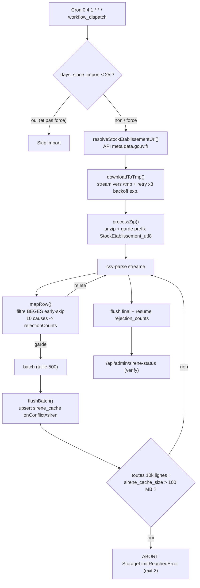
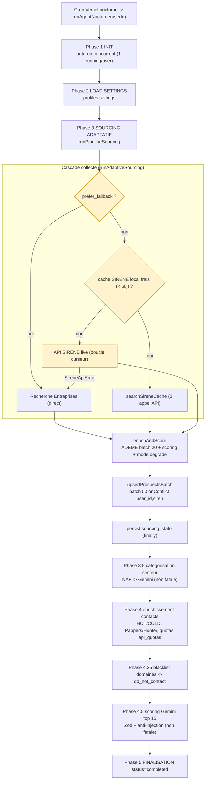

# Pipelines de données — ProspectionAgent

Documentation factuelle des deux pipelines de données du SaaS de prospection BEGES.
Chaque affirmation référence le fichier et la ligne source.

> Document de référence (lecture). Il décrit le comportement existant en production
> — il ne modifie rien. Les chemins sont relatifs à la racine du dépôt.

## Vue d'ensemble

Deux pipelines alimentent la table `prospects` :

1. **ETL mensuel SIRENE** — peuple le miroir local `sirene_cache` à partir du stock
   public INSEE publié sur data.gouv.fr. Sert de source primaire « offline » au
   sourcing (l'API SIRENE live étant instable).
2. **Pipeline nocturne (run agent)** — pour chaque utilisateur, source de nouvelles
   entreprises (cascade cache → SIRENE → Recherche Entreprises), les enrichit
   (ADEME / contacts), les score (Gemini), puis upsert dans `prospects`.

Les deux sont idempotents (upsert sur clé naturelle) et conçus pour les contraintes
free tier (storage Supabase 500 MB, quotas API tiers, timeout serverless Vercel).

---

## Pipeline 1 — ETL mensuel SIRENE

Source : `scripts/import-sirene-bulk.ts`. Déclencheur : `.github/workflows/sirene-import.yml`.
Cible : table publique `sirene_cache` (Supabase, service_role).

### Déclenchement

- Cron mensuel : `0 4 1 * *` (1er du mois à 04:00 UTC) — `.github/workflows/sirene-import.yml:6`.
- Trigger manuel `workflow_dispatch` avec input booléen `force`
  (`.github/workflows/sirene-import.yml:8-14`).
- Garde de fraîcheur : avant l'ETL, appel à `/api/admin/sirene-status` ; si
  `days_since_import < 25`, l'import est sauté (`.github/workflows/sirene-import.yml:44-59`),
  sauf `force=true`.
- Runtime : Node 22 (`setup-node@v4`), `npm ci`, puis `npm run import-sirene`
  (`.github/workflows/sirene-import.yml:35-64`). Le script tourne via
  `node --experimental-strip-types` (`package.json:14`).
- Timeout : job 60 min, step ETL 45 min (`.github/workflows/sirene-import.yml:23,64`).
  L'ETL n'est volontairement PAS un cron Vercel (cap 800s vs 15-30 min réels —
  `scripts/import-sirene-bulk.ts:43`).
- Secrets injectés via l'environnement GitHub « Production – strofe-prospection-agent » :
  `NEXT_PUBLIC_SUPABASE_URL`, `SUPABASE_SERVICE_ROLE_KEY`, `CRON_SECRET`, `APP_URL`,
  + `MAX_STORAGE_MB=100`, `SIRENE_BATCH_SIZE=500` (`.github/workflows/sirene-import.yml:22-29`).

### Résolution dynamique de la source

Les resource IDs data.gouv.fr changent à chaque republication mensuelle INSEE — un ID
en dur finit toujours par pointer sur le mauvais fichier (`scripts/import-sirene-bulk.ts:62-68,419-425`).

- L'URL est résolue dynamiquement via l'API métadonnée du dataset
  `base-sirene-des-entreprises-et-de-leurs-etablissements-siren-siret`
  (`scripts/import-sirene-bulk.ts:69-72`), sauf override explicite `SIRENE_DOWNLOAD_URL`
  (`scripts/import-sirene-bulk.ts:77`).
- `resolveStockEtablissementUrl()` (`scripts/import-sirene-bulk.ts:426-486`) sélectionne la
  ressource dont le titre contient `StockEtablissement` et EXCLUT les tokens
  `Historique`, `LiensSuccession`, `Doublons`, `UniteLegale`, `parquet`, `.pdf`, `.csv`
  (`scripts/import-sirene-bulk.ts:457-471`). Échec explicite si aucune ressource ne matche
  (`scripts/import-sirene-bulk.ts:473-478`).

### Téléchargement (streaming + retry x3)

`downloadToTmp()` — `scripts/import-sirene-bulk.ts:488-553` :

- Fetch streamé vers `/tmp` via `Readable.fromWeb` + `pipeline` (pas de chargement mémoire
  du ZIP ~700 MB — `scripts/import-sirene-bulk.ts:516-519`).
- Retry exponentiel : `DOWNLOAD_MAX_RETRIES=3`, backoff initial 2000 ms doublé à chaque
  tentative (`scripts/import-sirene-bulk.ts:91-92,540-543`).
- HTTP 5xx → retry ; HTTP 4xx → abandon immédiat (non-retryable —
  `scripts/import-sirene-bulk.ts:508-514,528,539`).
- Cleanup best-effort du fichier partiel à chaque échec (`scripts/import-sirene-bulk.ts:534-538`).

### Garde-fous format

`processZip()` — `scripts/import-sirene-bulk.ts:567-714` :

- Ouverture du ZIP via `unzipper.Open.file`, recherche d'un unique `.csv`
  (`scripts/import-sirene-bulk.ts:578-582`).
- Garde format : le nom du CSV doit commencer par `StockEtablissement_utf8`
  (`EXPECTED_CSV_PREFIX`, `scripts/import-sirene-bulk.ts:75,586-591`). Si une mauvaise
  ressource a été téléchargée, échec tôt avec message clair (plutôt qu'après 30 min de
  parsing qui rejetterait 100 % des lignes).
- Parsing streamé `csv-parse` : `columns: true`, `relax_quotes`, `relax_column_count`
  (`scripts/import-sirene-bulk.ts:594-603`).

### Filtre BEGES + rejectionCounts (10 causes)

`mapRow()` — `scripts/import-sirene-bulk.ts:270-340`. Early-skip dans cet ordre ; chaque rejet
incrémente un compteur de l'objet `rejectionCounts` (`scripts/import-sirene-bulk.ts:256-268`) :

| # | Cause (`rejectionCounts`) | Règle | Source |
|---|---|---|---|
| 1 | `etat` | `etatAdministratifEtablissement === 'A'` (actif) | `:272-275` |
| 2 | `siege` | `etablissementSiege === 'true'` (siège uniquement) | `:276-279` |
| 3 | `tranche_missing` | tranche d'effectifs présente | `:281-285` |
| 4 | `tranche_excluded` | tranche ∈ `KEPT_TRANCHES` (≥ 10 salariés) | `:286-289` |
| 5 | `naf_missing` | section NAF dérivable du code activité | `:291-296` |
| 6 | `naf_excluded` | section ∈ `KEPT_NAF_SECTIONS` | `:297-300` |
| 7 | `siren_missing` | SIREN non vide | `:302-307` |
| 8 | `siret_missing` | SIRET non vide | `:308-311` |
| 9 | `siren_format` | SIREN = 9 chiffres (`/^\d{9}$/`) | `:312-316` |
| 10 | `siret_format` | SIRET = 14 chiffres (`/^\d{14}$/`) | `:317-320` |

- Tranches retenues : `21,22,31,32,41,42,51,52,53` (≥ 10 salariés) — `KEPT_TRANCHES`,
  `scripts/import-sirene-bulk.ts:102-104`. Bornes effectif min/max par tranche dans
  `TRANCHE_RANGES` (`scripts/import-sirene-bulk.ts:107-117`).
- Sections NAF retenues : `A` (Agriculture), `C` (Industrie), `D` (Énergie),
  `E` (Eau/déchets), `F` (Construction), `H` (Transport) — `KEPT_NAF_SECTIONS`,
  `scripts/import-sirene-bulk.ts:120`. Dérivation via `sectionFromNaf()`
  (`scripts/import-sirene-bulk.ts:161-173`).
- Normalisation NAF (`0121Z` → `01.21Z`) via `normalizeNaf()` (`scripts/import-sirene-bulk.ts:221-229`).
- En DRY_RUN, les compteurs et un échantillon de 5 lignes brutes sont loggés à la fin du diag
  (`scripts/import-sirene-bulk.ts:638-663`).

### Upsert idempotent (batch 500)

`flushBatch()` — `scripts/import-sirene-bulk.ts:346-360` :

- Upsert dans `sirene_cache` avec `onConflict: 'siren', ignoreDuplicates: false`
  → idempotent et rejouable sans corruption (`scripts/import-sirene-bulk.ts:348-350`).
- Taille de batch = `SIRENE_BATCH_SIZE` (défaut 500 — `scripts/import-sirene-bulk.ts:80`).
  Flush quand `batch.length >= BATCH_SIZE` (`scripts/import-sirene-bulk.ts:630-633`), plus
  flush final (`scripts/import-sirene-bulk.ts:700-702`).

### Garde-fou storage (free tier 500 MB)

`getStorageStat()` — `scripts/import-sirene-bulk.ts:367-393` :

- Toutes les 10 000 lignes (`STORAGE_CHECK_EVERY_ROWS`, `scripts/import-sirene-bulk.ts:83`),
  on flush le batch courant puis on lit la vue `sirene_cache_size` (migration 019)
  (`scripts/import-sirene-bulk.ts:677-696`).
- Si `total_mb > MAX_STORAGE_MB` (défaut 100 — `scripts/import-sirene-bulk.ts:79`),
  ABORT via `StorageLimitReachedError` → `exit code 2`
  (`scripts/import-sirene-bulk.ts:395-409,686-693,784-790`).
- Logs de progression toutes les 10 000 lignes (`LOG_EVERY_ROWS`,
  `scripts/import-sirene-bulk.ts:82,666-673`) ; résumé final avec `rejection_counts`
  (`scripts/import-sirene-bulk.ts:772-782`).

### DRY_RUN

- `SIRENE_DRYRUN=1` (`scripts/import-sirene-bulk.ts:88`) : parse les premières
  `SIRENE_DRYRUN_LIMIT` lignes (défaut 2000 — `scripts/import-sirene-bulk.ts:89`),
  log colonnes réelles + échantillon + `rejection_counts`, puis sort. PAS d'upsert,
  PAS de check storage (`scripts/import-sirene-bulk.ts:622-663,677`).

### Aval

La vérité de fraîcheur de `sirene_cache` est consommée côté pipeline nocturne :
le cache est considéré obsolète au-delà de 60 jours (`CACHE_STALE_THRESHOLD_DAYS`,
`lib/agent/sirene-cache.ts:41`), soit ~2× la cadence d'import mensuelle.

### Diagramme — phases ETL SIRENE

---

## Pipeline 2 — Pipeline nocturne (run agent)

Orchestrateur : `lib/agent/orchestrator.ts` (`runAgentNocturne`, `:869`). Le run nocturne
s'arrête après l'upsert des prospects ; aucune daily list n'est générée
(`lib/agent/orchestrator.ts:1-11,1033-1034`). L'UI lit directement la table `prospects`.

### Phases de l'orchestrateur

| Phase | Fonction | Fatale ? | Source |
|---|---|---|---|
| 1. Init | `phaseInit` (anti-run concurrent : 1 `running`/user) | oui | `:122-176` |
| 2. Load settings | `phaseLoadSettings` | oui | `:182-212` |
| 3. Sourcing adaptatif + enrich ADEME + scoring + upsert | `phaseSourcingAdaptive` → `runPipelineSourcing` | oui | `:230-288` |
| 3.5 Catégorisation secteur | `phaseSecteurCategorisation` (cascade NAF → Gemini) | non | `:322-469` |
| 4. Enrichissement contacts | `phaseContactEnrichment` (HOT/COLD) | non | `:493-662` |
| 4.25 Blacklist domaines | `checkBlacklistedDomains` | non | `:983-1009` |
| 4.5 Scoring Gemini | `phaseGeminiScoring` (top 15) | non | `:695-853` |
| 5. Finalisation | status `completed` | — | `:1030-1043` |

Les phases non-fatales sont enveloppées dans des `try/catch` qui loggent `warn` sans bloquer
le pipeline (`lib/agent/orchestrator.ts:951-1025`). L'état du run est persisté entre chaque
phase via `updateRunInDB` (`lib/agent/orchestrator.ts:83-116`).

### Cœur du sourcing — `runPipelineSourcing`

`lib/agent/sourcing-runner.ts:1682-1853` (fichier WIP — lecture seule). Séquence :

1. Résolution des filtres effectifs + signature SHA des filtres
   (`resolveSourcingFilters`, `:297-365` ; `:1696-1705`).
2. Chargement de `profiles.sourcing_state` et décision du curseur initial
   (`resolveStartCurseur`, `:398-416` ; `:1707-1720`).
3. Chargement du `sirenSet` (SIREN déjà en base, pour dédup — `:1727-1737`).
4. Cible adaptative : `targetCandidates = max(sourcing_target_per_run × 3, 50)`
   (`:1739-1741`).
5. Boucle adaptative + enrich + score + upsert (`:1763-1829`).
6. Persistance de `sourcing_state` dans un `finally` (curseur jamais perdu, même
   sur crash — `:1830-1846`).

### Cascade des sources de collecte — `runAdaptiveSourcing`

`lib/agent/sourcing-runner.ts:604-985`. Ordre de tentative :

1. **Mode préférence fallback** — si `settings.prefer_fallback_recherche_entreprises === true`,
   court-circuite SIRENE et passe direct par Recherche Entreprises (`:635-698`). Use case :
   API INSEE durablement KO (bug HTTP 400 prod 2026-05-17, `:632-634`).
2. **Cache SIRENE local** — si un client Supabase est fourni, `searchSireneCache` est tenté
   EN PREMIER (zéro appel réseau, une requête PL/pgSQL — `:711-810`). Le cache embarque
   l'univers complet pour ces filtres → `exhausted=true`. Enrichissement des raisons sociales
   manquantes via Recherche Entreprises batch (`:750-771`). Si le cache est vide / obsolète
   (> 60j, `lib/agent/sirene-cache.ts:41`) → bascule transparente sur l'API live.
3. **API SIRENE live** — boucle par curseur (`sourcerEntreprises`, `:812-960`). Une page par
   appel pour rester adaptatif (`:833-836`). Sur `SireneApiError` à la 1ère page, fallback
   unique vers `sourcerEntreprisesFallback` (Recherche Entreprises, pas de pagination — `:854-905`).
   Échec total des deux sources → Sentry + throw (`:878-905`).

Garde post-fetch dans les 3 branches : `matchesAnyNaf` + filtre par section NAF avant insert
(`:611-615,920-940`). Le curseur SIRENE signale la fin d'univers quand
`curseurSuivant === curseur` (`lib/agent/sourcing.ts:296-297,727`).

### Enrichissement ADEME + scoring — `enrichAndScore`

`lib/agent/sourcing-runner.ts:1042-1182` :

- Enrichissement BEGES ADEME par batches de 20 (`ADEME_BATCH_SIZE`, `:161,1077,1101-1102`),
  `Promise.allSettled` → un échec ADEME bascule l'établissement en mode dégradé
  (`buildDegradedProspect`, `:1004-1027,1119-1122`).
- Scoring numérique via `calculerScore` / `getScoreDetails` (`:1156-1158`). Tous les nouveaux
  prospects entrent en statut `sourced` ; la promotion `qualified` se fait plus tard
  (règle métier 2026-05-26, `:1159-1172`).
- Upsert par batches de 50 (`UPSERT_BATCH_SIZE`, `upsertProspectsBatch`, `:1195-1328`)
  avec `onConflict: 'user_id,siren'`. Préservation du statut `do_not_contact` (strip de
  `statut`/`priorite` à l'upsert — `:1204-1254`). Fallback rétro-compat si colonnes
  `beges_*` / `bilan_ges_data` absentes (`:1267-1301`).

### Enrichissement contacts (cascade Pappers / Hunter)

`lib/agent/contact-enrichment.ts`. Cascade séquentielle par SIREN :
Recherche Entreprises → Pappers → Hunter Domain Search → Hunter Email Finder
(`contact-enrichment.ts:7-9`). Pappers se désactive pour la session sur HTTP 401
(crédits épuisés) et refund le crédit DB consommé (`contact-enrichment.ts:70-71,595-605`).

Côté orchestrateur (`phaseContactEnrichment`, `lib/agent/orchestrator.ts:493-662`) :
tri HOT/COLD — HOT = `obligation_beges && (!beges_publie || !beges_valide)` passe en priorité
dans la cascade payante (`:541-553`). Exclusions RGPD : opt-out (`filterOptedOutSirens`, `:531-535`),
statuts `do_not_contact`/`rejected` (`:512-513`), et un email perso n'écrase jamais le primary
(`isProfessionalEmail`, `:616-623`). Cap 150 prospects/run (`:516`).

### Scoring Gemini (Zod + anti-injection)

`lib/agent/gemini-scoring.ts`. Modèle figé `gemini-2.0-flash` (`:32`), structured output natif
(`responseSchema`, `:120-134,162-168`).

- **Validation Zod** systématique de la sortie : `interet_score` entier 0-100, 3 à 5 `raisons`
  de 5-500 chars (`geminiResponseSchema`, `:104-114`). Parsing + validation dans
  `parseGeminiResponse` (`:297-318`) ; validation KO → fallback propre sans throw (`:324-330,460-465`).
- **Anti-injection** : `sanitizeForPrompt` strippe les caractères de contrôle, échappe `< >`,
  et détecte 8 patterns heuristiques de prompt injection (`INJECTION_PATTERNS`, `:178-209`).
  Le prompt système isole les données externes dans `<données_entreprise>` avec consigne
  d'ignorer toute instruction qu'elles contiennent (`:83,260-273`).
- **PII** : `GeminiProspectInput` est un `Pick` restreint du `Prospect` qui exclut
  structurellement `contact_email`/`contact_telephone`/`contact_nom`/`contact_prenom`
  (`:220-232`). Contexte réglementaire figé dans le prompt (L. 229-25, > 500 salariés,
  amende 10 000 € — `:78-81`).
- Robustesse : timeout 15 s par appel (`:35`), 1 retry sur 429/5xx (`:38,341-358`), parallélisme
  limité à 5 avec délai inter-groupes (`:43-47,479-518`). Phase orchestrateur top 15
  (`GEMINI_TOP_N`, `lib/agent/orchestrator.ts:672`).
- La catégorisation secteur réutilise le même garde-fou (Zod `secteurResponseSchema` `:594-608`,
  cache LRU 1h `:570-693`, throttle 50 ms `:568,641-647`) et renvoie `null` (jamais throw) sur
  tout cas dégradé (`:725-828`).

### Anti-timeout serverless

Cron Vercel : timeout dur 300 s. Garde-fous (`lib/agent/sourcing-runner.ts`) :

- **Soft-timeout** enrichissement : `ENRICH_SOFT_TIMEOUT_MS = 180s` — au-delà, les SIREN
  restants sont insérés en mode dégradé et retentés au run suivant (`:171,1080-1099`).
- **Caps durs** : `HARD_CAP_PAGES = 50`, `HARD_CAP_DURATION_MS = 4 min` sur la boucle
  adaptative (`:164-165,812-825,962-972`) ; `ENRICH_MAX_ETABLISSEMENTS = 80` par run
  (`:176,1058-1072`).
- **Heartbeat** : `startHeartbeat` pousse un log toutes les 30 s avec la phase courante
  (`HEARTBEAT_INTERVAL_MS`, `:202,530-556`), permettant le diag post-mortem quand Vercel
  kill la fonction sans laisser logguer l'erreur (bug 2026-05-12, `:198-201`).
- **Mode dégradé** : `buildDegradedProspect` insère un prospect sans BEGES ni téléphone ;
  l'upsert idempotent garantit la reprise au prochain run (`:1004-1027`).
- **Circuit breaker** Recherche Entreprises (téléphone) : ouvre après 30 échecs consécutifs
  pour le reste du process (`RE_PHONE_CIRCUIT_BREAKER_THRESHOLD`, `lib/agent/sourcing.ts:146,150-183`),
  reset au début de chaque phase d'enrichissement (`resetRePhoneCircuit`,
  `lib/agent/sourcing-runner.ts:1051`).

### Quotas persistés (`api_quotas`)

`lib/agent/quotas.ts`. Quotas mensuels par `(user_id, provider, month_start)` survivant aux
cold starts Vercel (`:1-13`). Free tiers : Pappers 100/mois, Hunter 25/mois, INPI 10000,
Google CSE 3000 (`QUOTA_LIMITS`, `:38-43`).

- Reset mensuel automatique au 1er du mois (`getCurrentMonthStart`, `:60-66`).
- `consumeQuota` : UPDATE conditionnel optimistic-locking (`used_count = state.used`) — race
  perdue → considéré épuisé (`:215-291`). `refundQuota` plancher 0 (`:298-358`). `withQuota`
  wrappe check + consume + refund-on-error (`:368-388`).
- Mode dégradé : toute erreur DB renvoie un état non-épuisé pour ne pas bloquer le pipeline
  (`:140-149`).

### Diagramme — phases du run nocturne

Garde-fous transverses au run : heartbeat 30s, soft-timeout 180s, caps durs
(50 pages / 4 min / 80 étabs), circuit breaker téléphone (30 échecs), quotas persistés.
